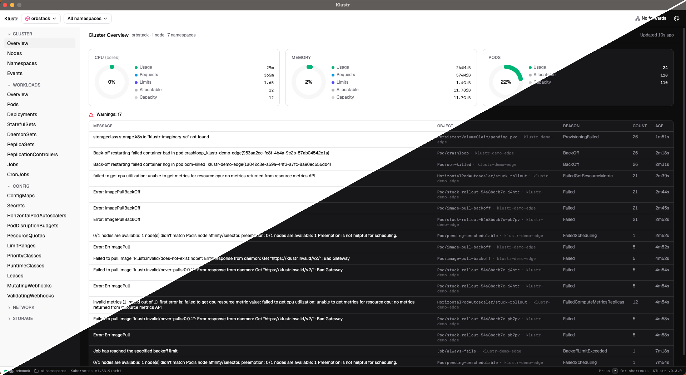

<p align="center">
  
</p>

<h1 align="center">Klustr</h1>

<p align="center">
  A native Kubernetes desktop client that installs <strong>nothing</strong> in your cluster.
</p>

<p align="center">
  <a href="https://github.com/SametKUM/klustr/releases/latest">
    
  </a>
  <a href="https://github.com/SametKUM/klustr/actions/workflows/release.yml">
    
  </a>
  <a href="LICENSE">
    
  </a>
  
</p>

<p align="center">
  
</p>

## What is Klustr?

Klustr is a cross-platform Kubernetes desktop client built with [Wails](https://wails.io/) (Go + native webview) and React. It uses your existing `~/.kube/config` and speaks the standard Kubernetes API directly — **nothing is deployed in the cluster**. Drop the binary in, point at any context, and you're looking at a live view of everything you have permission to see.

## Features

- 🔌 **Pure client.** No CRDs, no in-cluster components, no extra RBAC. Works with whatever your kubeconfig already grants.
- 🔁 **Live updates everywhere.** Resources stay fresh via `client-go` informers — never polled.
- 🌐 **Multi-context.** Switch clusters in one click; pin a default for autoconnect.
- 📋 **Every built-in resource kind.** Pods, Deployments, StatefulSets, DaemonSets, ReplicaSets, ReplicationControllers, Jobs, CronJobs, HPAs, PDBs, Services, Endpoints, EndpointSlices, Ingresses, NetworkPolicies, ConfigMaps, Secrets, ResourceQuotas, LimitRanges, Leases, Mutating/ValidatingWebhookConfigurations, PVCs, PVs, StorageClasses, Nodes, Namespaces, IngressClasses, PriorityClasses, RuntimeClasses, and Events.
- 📜 **Logs and aggregated logs.** Stern-style multi-pod log streaming with per-pod ANSI colors, follow, save and regex.
- 🖥️ **In-app exec.** Open a shell into any container over SPDY.
- 🔧 **YAML edit with diff.** Monaco editor with a server-side dry-run diff before apply.
- 🚀 **Scale and restart.** Replica controls with the current value pre-filled, +/- buttons and ↑/↓ keys; one-click rolling restart for Deployments / StatefulSets / DaemonSets.
- 🔄 **Port-forwarding manager.** Suggested local ports, persistent header indicator, click-to-open in browser.
- 🗺️ **Cluster overviews.** CPU / memory / pod donuts, workloads health bars, recent warnings at a glance.
- 🧭 **Cross-resource navigation.** Drill from a workload into a related pod, jump to its node or controlling ReplicaSet, and back-arrow your way home.
- 🎨 **Themes, command palette (`⌘P`), namespace search (`⌘N`), keyboard cheatsheet (`?`).**

## Screenshots

|   |   |
|---|---|
|  |  |
| **Cluster overview** — CPU / memory / pod donuts, warnings | **Live resource browser** — usage bars, restart badges |
|  |  |
| **Pod detail** — env, containers, conditions, clickable owner & node | **Aggregated logs** — Stern-style across a workload |
|  |  |
| **YAML edit** — Monaco diff before apply | **Port-forwarding** — suggested ports, status indicator |

## Install

### macOS (Apple Silicon)

Download the latest darwin-arm64 tarball from the [Releases](https://github.com/SametKUM/klustr/releases/latest) page, then:

```bash
tar -xzf klustr-*-darwin-arm64.tar.gz
mv klustr.app /Applications/
xattr -cr /Applications/klustr.app   # silence Gatekeeper (build is not notarized yet)
open /Applications/klustr.app
```

### Windows / Linux

Windows and Linux builds will be attached to releases once they've been validated on each platform. Until then, please build from source — see [Build from source](#build-from-source).

## Quick start

1. Klustr reads `~/.kube/config` at launch.
2. On first run, pick a context from the connection picker. Toggle **Auto-connect** on a card to pin it as the default.
3. Browse via the sidebar, click any row for a detail dialog, or `⌘P` to fuzzy-search resources by name.

## Build from source

```bash
mise install     # installs Go, Node, Wails CLI pinned in .mise.toml
wails dev        # hot-reload dev session

# or a production build for your host platform
wails build -trimpath -clean
```

## Architecture (short version)

| Layer | Choice |
|---|---|
| Desktop | Wails v2 (Go + native webview) |
| Backend | Go 1.26 + `client-go` (typed clientset + dynamic) |
| Frontend | React 19 · TypeScript · Vite |
| UI | Tailwind CSS · shadcn/ui |
| State | Zustand (real-time) · TanStack Query (mutations only) |
| Tables | TanStack Table |
| Live data | `client-go` informers → Wails events → Zustand → React |

Full design notes, conventions and the "add a new resource kind" recipe live in [`CLAUDE.md`](CLAUDE.md).

## Roadmap

- [x] Every built-in resource kind
- [x] Logs, exec, port-forwarding
- [x] YAML edit / apply with diff, scale, restart
- [x] Cross-resource navigation (related pods, owner/node links, back stack)
- [ ] Notarized macOS build
- [ ] Linux & Windows release distribution (after per-platform testing)
- [ ] Custom Resource Definitions (CRDs)
- [ ] Helm support — release browser, values diff, install / upgrade / rollback

## Contributing

Bug reports and pull requests are welcome.

- Read [`CLAUDE.md`](CLAUDE.md) first — it's the architecture + conventions contract.
- Use [Conventional Commits](https://www.conventionalcommits.org/) (`feat:`, `fix:`, `refactor:` …) and prefer small, logically scoped commits.
- Before opening a PR, run:
  ```bash
  go test klustr/internal/... && go vet ./...
  cd frontend && npm test && npm run lint && npm run typecheck
  ```
- New user-facing features should include a screenshot or short clip in the PR description.

## License

[MIT](LICENSE) © Samet Kum

## Acknowledgments

Built on the shoulders of: [Wails](https://wails.io/), [client-go](https://github.com/kubernetes/client-go), [React](https://react.dev/), [shadcn/ui](https://ui.shadcn.com/), [Tailwind CSS](https://tailwindcss.com/), [TanStack Table / Query](https://tanstack.com/), [xterm.js](https://xtermjs.org/), [Monaco Editor](https://microsoft.github.io/monaco-editor/), [Zustand](https://zustand-demo.pmnd.rs/), [Vite](https://vitejs.dev/), [mise](https://mise.jdx.dev/).
