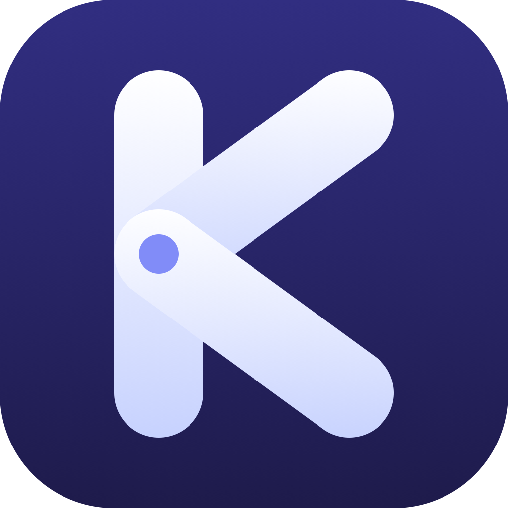
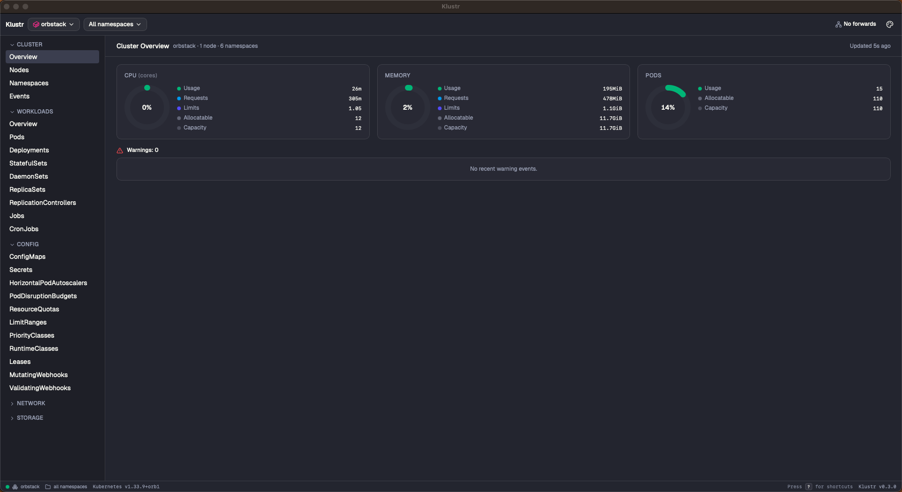
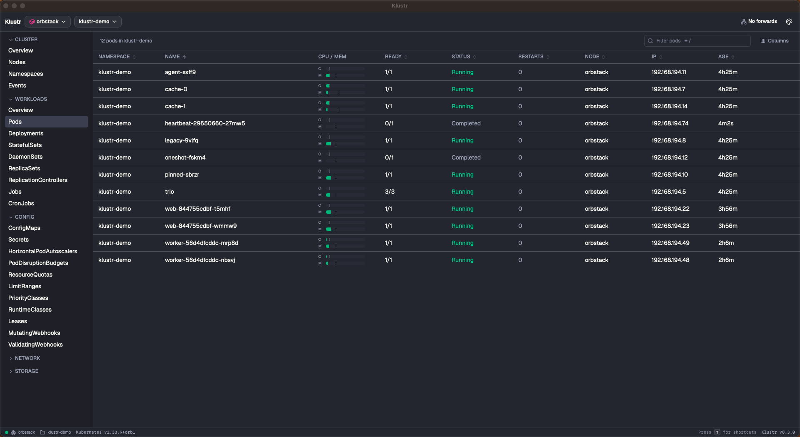
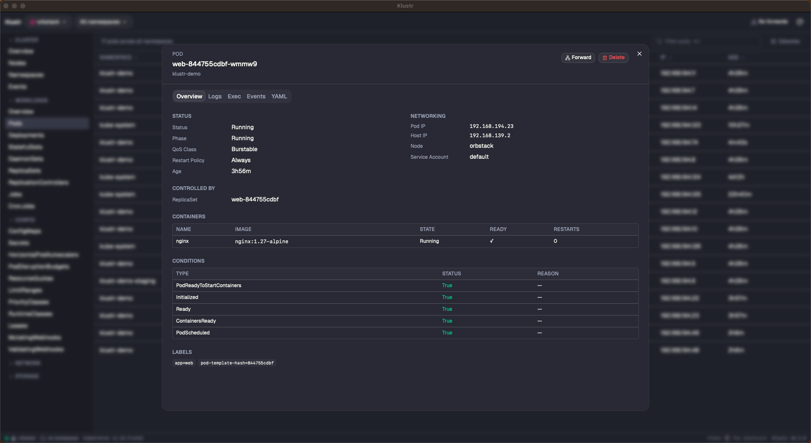
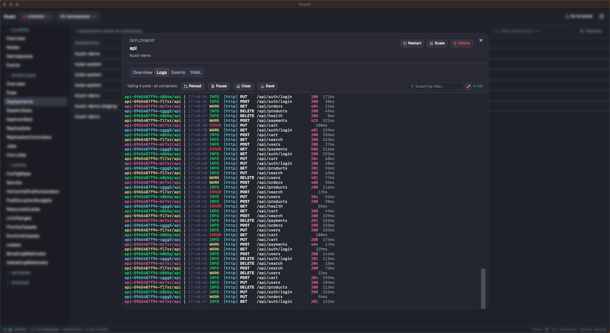
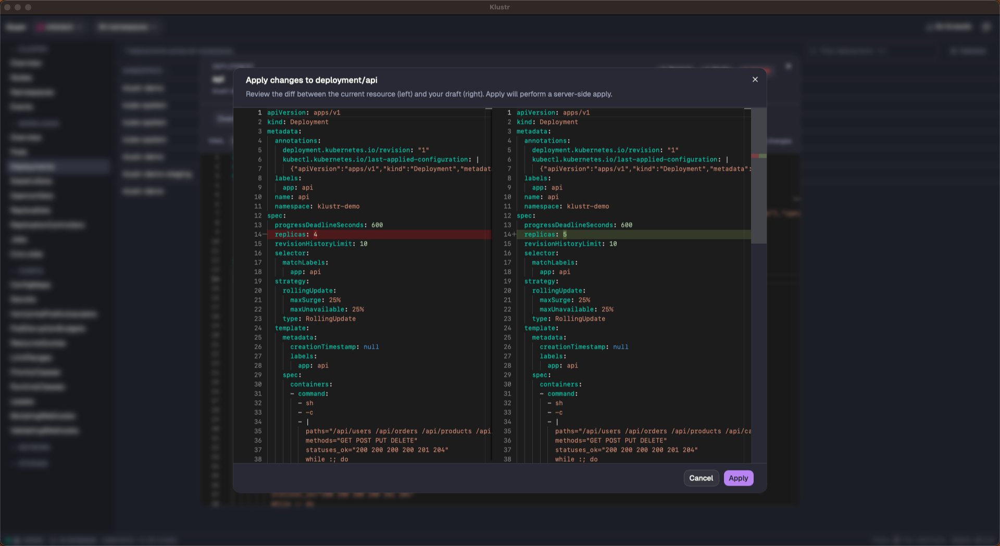
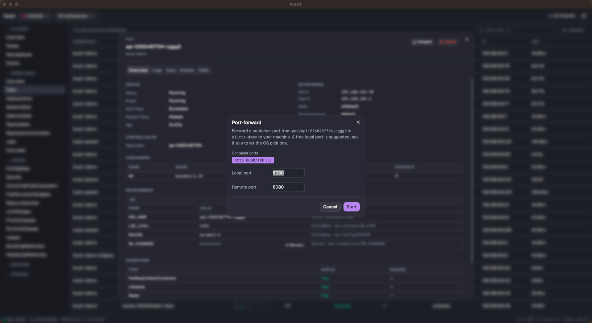
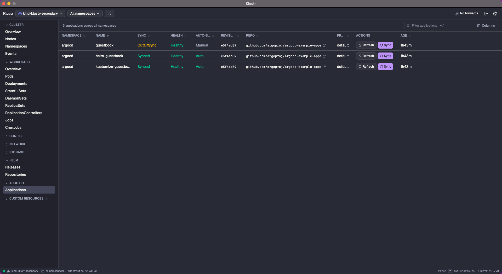

<p align="center">
  
</p>

<h1 align="center">Klustr</h1>

<p align="center">
  A native Kubernetes desktop client that installs <strong>nothing</strong> in your cluster.
</p>

<p align="center">
  <a href="https://github.com/SametKUM/klustr/releases/latest">
    
  </a>
  <a href="https://github.com/SametKUM/klustr/actions/workflows/release.yml">
    
  </a>
  <a href="LICENSE">
    
  </a>
  
</p>

<p align="center">
  <video src="https://github.com/SametKUM/klustr/raw/main/docs/hero.mp4" autoplay loop muted playsinline width="900" poster="docs/hero-poster.png">
    <a href="docs/hero.mp4"></a>
  </video>
</p>

## What is Klustr?

Klustr is a cross-platform Kubernetes desktop client built with [Wails](https://wails.io/) (Go + native webview) and React. It uses your existing `~/.kube/config` and speaks the standard Kubernetes API directly — **nothing is deployed in the cluster**. Drop the binary in, point at any context, and you're looking at a live view of everything you have permission to see — built-in resources, full **RBAC** with a **subject → effective-permissions** review, **Custom Resources (CRDs)**, **Helm releases**, **Argo CD Applications**, and **Gateway API** routes included. No extra logins, no `argocd` or `helm` CLI required — only your kubeconfig.

## Features

- 🔌 **Pure client.** No CRDs, no in-cluster components, no extra RBAC. Works with whatever your kubeconfig already grants.
- 🔁 **Live updates everywhere.** Resources stay fresh via `client-go` informers — never polled.
- 🌐 **Multi-context, multi-cluster.** Switch clusters in one click, or pick two-plus contexts and view them **aggregated** — every table, the cluster overview, workloads health, and events fan out across all selected clusters with a Context column. Pin a default for autoconnect. Each active context is **pinged every ~25 s** in the status bar with its own coloured dot, latency, and tooltip — slow pings turn amber, failures (timeout, 401, refused) light up red with the real error.
- 👥 **Context groups & tags.** Save named multi-context groups (e.g. `prod-fleet`) and color-tag contexts (prod / staging / dev) so the top bar reminds you which environment you're touching.
- 📋 **Every built-in resource kind.** Pods, Deployments, StatefulSets, DaemonSets, ReplicaSets, ReplicationControllers, Jobs, CronJobs, HPAs, PDBs, Services, Endpoints, EndpointSlices, Ingresses, NetworkPolicies, ConfigMaps, Secrets, ResourceQuotas, LimitRanges, Leases, Mutating/ValidatingWebhookConfigurations, PVCs, PVs, StorageClasses, Nodes, Namespaces, IngressClasses, PriorityClasses, RuntimeClasses, Events, and the full **RBAC** set (ServiceAccounts, Roles, RoleBindings, ClusterRoles, ClusterRoleBindings) under a dedicated Access Control sidebar group.
- 🔎 **Access Review — "who can do what?".** Pick any subject (ServiceAccount / User / Group) and see its effective permissions as a **GVR × verb matrix**, split by namespace and cluster-wide scope. Every ✓ traces back to the **binding → role** chain that granted it, including implicit groups like `system:serviceaccount:<ns>:<name>`, `system:serviceaccounts:<ns>` and `system:authenticated`. Wildcards (`*`) and `cluster-admin` light up with explicit badges so an over-privileged subject is impossible to miss. Live-updates as bindings change. In aggregated mode the same subject is checked across every active context — spot a missing binding in one cluster at a glance. **Zero extra API traffic** — runs entirely off the RBAC informer cache, the UI answer to `kubectl auth can-i --list` with no `--as` impersonation needed.
- 🧩 **Custom Resources (CRDs).** CRDs are auto-discovered from the cluster on connect and slot into the sidebar grouped by API group. Browse instances live (watch-backed, no polling), inspect their YAML, and drill in from any owner reference — the same flow as built-in kinds, no per-CRD configuration.
- ⎈ **Helm.** First-class Helm v3 support, talking to release Secrets directly through the informer cache so the list stays live without shelling out to `helm`. Browse releases, view revision history with diffs, install / upgrade / rollback / uninstall with a **dry-run preview** before any change hits the cluster, plus repo management and chart search across configured repositories.
- 🚢 **Argo CD.** A dedicated sidebar section (auto-detected from the `applications.argoproj.io` CRD) with colored Sync / Health pills, an **Auto-sync** indicator, shortened revision SHA and a **clickable repo URL** that opens in your browser. Per-row **Sync** and **Refresh** buttons hit the Application directly through the Kubernetes API — same triggers `argocd app sync` uses — so you don't need an Argo CD login, an exposed `argocd-server` or the `argocd` CLI on PATH. The Application detail dialog opens on a **Resources** tab listing every managed object; click any row to drill into its detail and use the back-arrow to return.
- 🌉 **Gateway API.** Auto-detected from the `gateway.networking.k8s.io` CRDs and slotted into a dedicated sidebar group: **Gateways, HTTPRoutes, GRPCRoutes, GatewayClasses, ReferenceGrants**. Backed by the typed `sigs.k8s.io/gateway-api` informer factory (not the dynamic client) so lists update live without polling. Tables surface colored **Programmed / Accepted** pills sourced from status conditions; detail dialogs render the full **listener table**, per-rule **match → backend → weight** matrix and the **RouteParentStatus** block, so a misrouted parent or `ResolvedRefs=False / RefNotPermitted` backend is one click away. Vendor-neutral — works with Envoy Gateway, Cilium Gateway, Istio, Contour, NGINX Gateway Fabric, or whatever conformant implementation the cluster runs.
- 📜 **Logs and aggregated logs.** Stern-style multi-pod log streaming with per-pod ANSI colors, follow, save and regex.
- 🖥️ **In-app exec.** Open a shell into any container over SPDY.
- 🔧 **YAML edit with diff.** Monaco editor with a server-side dry-run diff before apply.
- 🚀 **Scale, restart, pause/resume.** Replica controls with the current value pre-filled, +/- buttons and ↑/↓ keys; one-click rolling restart for Deployments / StatefulSets / DaemonSets; inline **pause / resume** with a `Paused` badge for Deployments; **HPA min/max replicas** editable straight on the HPA detail page.
- ⏪ **Rollout history & rollback.** A **History** tab on Deployments / StatefulSets / DaemonSets lists revisions with author, time and change cause; pick any past revision for a side-by-side template diff and roll back with one click — same path `kubectl rollout undo` uses, no CLI required.
- 🔄 **Port-forwarding manager.** Suggested local ports, persistent header indicator, click-to-open in browser.
- 🗺️ **Cluster overviews.** CPU / memory / pod donuts, workloads health bars, recent warnings at a glance — single-cluster or fanned out across an aggregate.
- 🧭 **Cross-resource navigation.** Drill from a workload into a related pod, jump to its node or controlling ReplicaSet, and back-arrow your way home.
- 🎨 **Themes, command palette (`⌘P`), namespace search (`⌘N`), keyboard cheatsheet (`?`).** The palette is derived from the sidebar groups so every kind (RBAC, Helm, Argo CD, CRDs …) shows up automatically, and it can search pods across **all active contexts** and toggle contexts in and out of aggregated mode without leaving the keyboard.

## Screenshots

|   |   |
|---|---|
|  |  |
| **Cluster overview** — CPU / memory / pod donuts, warnings | **Live resource browser** — usage bars, restart badges |
|  |  |
| **Pod detail** — env, containers, conditions, clickable owner & node | **Aggregated logs** — Stern-style across a workload |
|  |  |
| **YAML edit** — Monaco diff before apply | **Port-forwarding** — suggested ports, status indicator |
|  |   |
| **Argo CD** — Sync / Health pills, auto-sync state, clickable repo, per-row Sync & Refresh without `argocd` CLI |   |

## Install

### macOS (Apple Silicon)

The release build is signed with a Developer ID Application certificate and notarized by Apple, so Gatekeeper opens it directly — even offline.

#### Homebrew

```bash
brew tap sametkum/klustr
brew install klustr
```

After the initial `brew tap`, future updates are just `brew upgrade klustr` (or `brew upgrade` for everything), and `brew search klustr` / `brew info klustr` start finding it.

#### Manual

Download the latest darwin-arm64 tarball from the [Releases](https://github.com/SametKUM/klustr/releases/latest) page, then:

```bash
tar -xzf klustr-*-darwin-arm64.tar.gz
mv klustr.app /Applications/
open /Applications/klustr.app
```

### Windows / Linux

Windows and Linux builds will be attached to releases once they've been validated on each platform. Until then, please build from source — see [Build from source](#build-from-source).

## Quick start

1. Klustr reads `~/.kube/config` at launch.
2. On first run, pick a context — or check **two or more** to view them aggregated as one cluster. Save a recurring selection as a named **group** for one-click reconnect, and toggle **Auto-connect** on a card to pin it as the default.
3. Browse via the sidebar, click any row for a detail dialog, or `⌘P` to fuzzy-search resources by name. The header's **Disconnect** button drops you back to the picker at any time.

## Build from source

```bash
mise install     # installs Go, Node, Wails CLI pinned in .mise.toml
wails dev        # hot-reload dev session

# or a production build for your host platform
wails build -trimpath -clean
```

## Architecture (short version)

| Layer | Choice |
|---|---|
| Desktop | Wails v2 (Go + native webview) |
| Backend | Go 1.26 + `client-go` (typed clientset + dynamic) + `sigs.k8s.io/gateway-api` |
| Frontend | React 19 · TypeScript · Vite |
| UI | Tailwind CSS · shadcn/ui |
| State | Zustand (real-time) · TanStack Query (mutations only) |
| Tables | TanStack Table |
| Live data | `client-go` informers → Wails events → Zustand → React |

Full design notes, conventions and the "add a new resource kind" recipe live in [`CLAUDE.md`](CLAUDE.md).

## Roadmap

- [x] Every built-in resource kind (incl. full RBAC: ServiceAccounts, Roles, RoleBindings, ClusterRoles, ClusterRoleBindings)
- [x] **Access Review** — subject → effective-permission matrix with binding trace, implicit-group expansion (`system:serviceaccounts:*`, `system:authenticated`), wildcard / cluster-admin detection, live across every active context
- [x] Logs, exec, port-forwarding
- [x] YAML edit / apply with diff, scale, restart, deployment pause/resume, HPA inline edit
- [x] Rollout history with revision diff and one-click rollback (Deployments / StatefulSets / DaemonSets)
- [x] Cross-resource navigation (related pods, owner/node links, back stack)
- [x] Custom Resource Definitions (CRDs)
- [x] Helm support — release browser, dry-run diff, install / upgrade / rollback / uninstall, repo management
- [x] Gateway API — Gateways, HTTPRoutes, GRPCRoutes, GatewayClasses, ReferenceGrants (typed informers, status pills, listener / rule / RouteParentStatus tables)
- [x] Multi-cluster aggregated mode + named context groups + per-context health ping
- [x] Notarized macOS build — signed with a Developer ID Application certificate and notarized by Apple
- [ ] Linux & Windows release distribution (after per-platform testing)

## Contributing

Bug reports and focused pull requests are welcome.

- Read [`CLAUDE.md`](CLAUDE.md) first — it's the architecture + conventions contract.
- Use [Conventional Commits](https://www.conventionalcommits.org/) (`feat:`, `fix:`, `refactor:` …) and prefer small, logically scoped commits.
- Before opening a PR, run:
  ```bash
  go test klustr/internal/... && go vet ./...
  cd frontend && npm test && npm run lint && npm run typecheck
  ```
- New user-facing features should include a screenshot or short clip in the PR description.

Full guide: [`CONTRIBUTING.md`](CONTRIBUTING.md). Bug reports go through the [`bug_report.yml`](.github/ISSUE_TEMPLATE/bug_report.yml) issue template so the version / OS / cluster details we need actually land in the report.

## License

[MIT](LICENSE) © Samet Kum

## Acknowledgments

Built on the shoulders of: [Wails](https://wails.io/), [client-go](https://github.com/kubernetes/client-go), [React](https://react.dev/), [shadcn/ui](https://ui.shadcn.com/), [Tailwind CSS](https://tailwindcss.com/), [TanStack Table / Query](https://tanstack.com/), [xterm.js](https://xtermjs.org/), [Monaco Editor](https://microsoft.github.io/monaco-editor/), [Zustand](https://zustand-demo.pmnd.rs/), [Vite](https://vitejs.dev/), [mise](https://mise.jdx.dev/).
