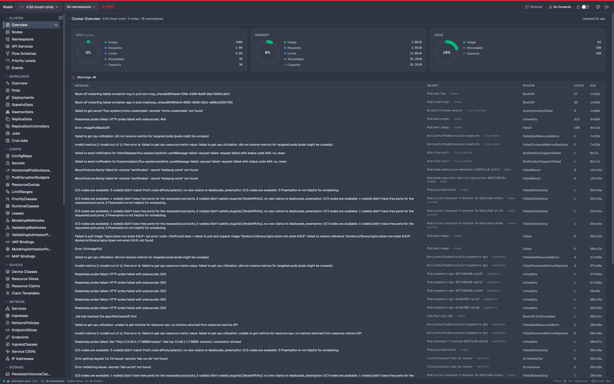
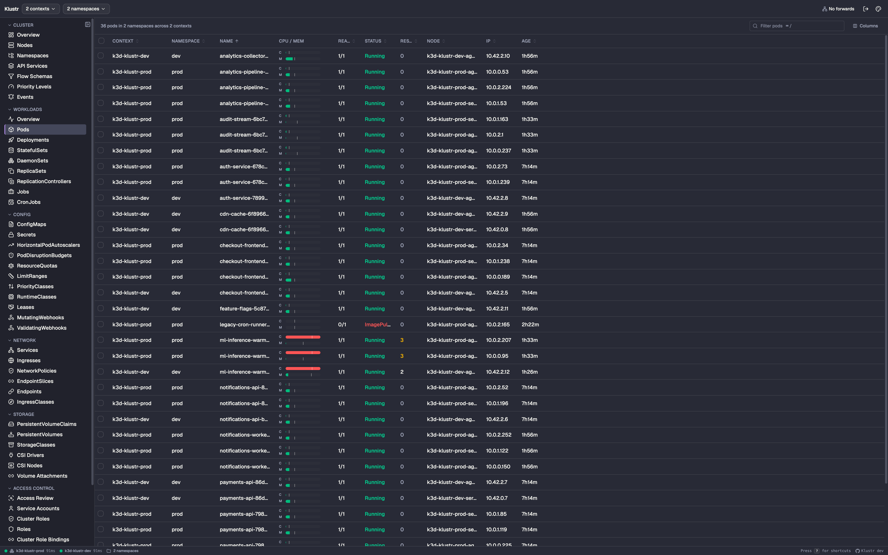
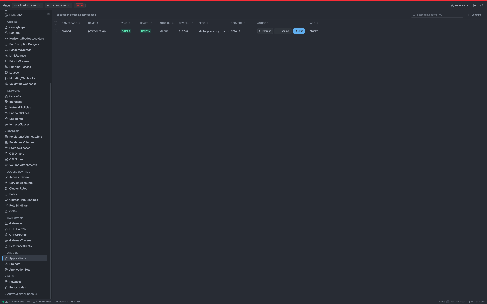
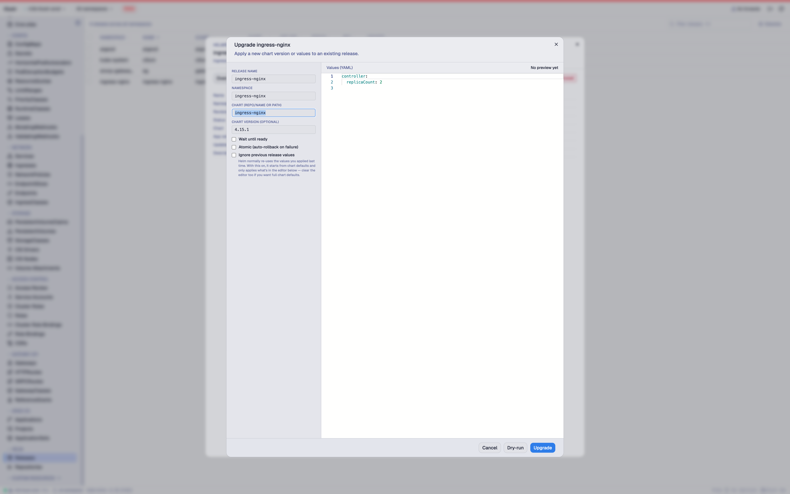
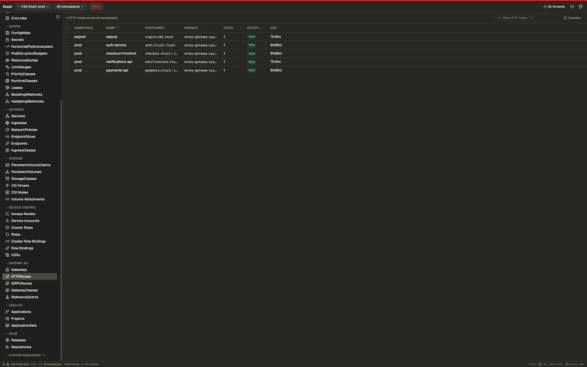
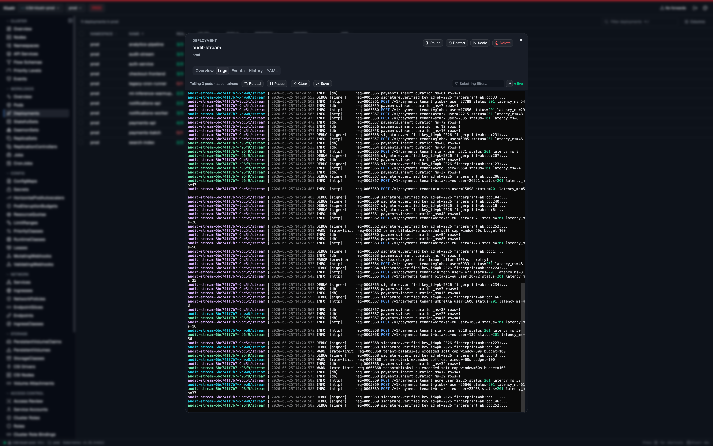
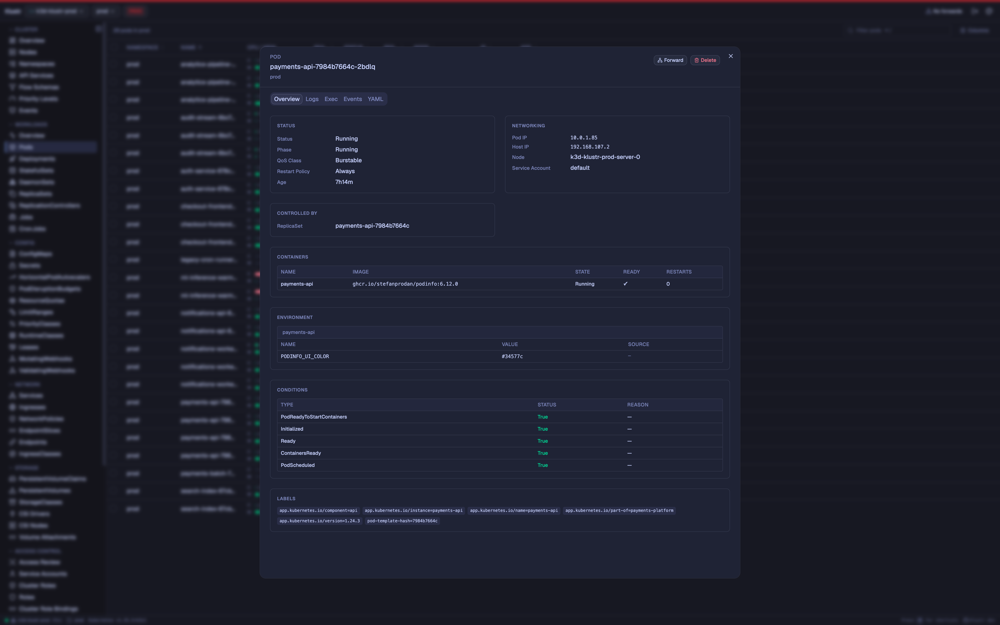
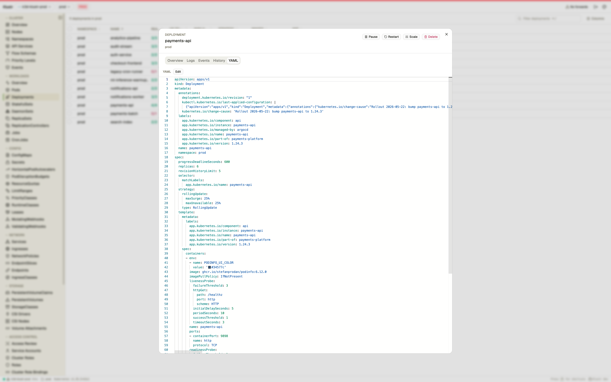

<p align="center">
  
</p>

<h1 align="center">Klustr</h1>

<p align="center">
  A native Kubernetes desktop client that installs <strong>nothing</strong> in your cluster.
</p>

<p align="center">
  <a href="https://github.com/SametKUM/klustr/releases/latest">
    
  </a>
  <a href="https://github.com/SametKUM/klustr/actions/workflows/release.yml">
    
  </a>
  <a href="LICENSE">
    
  </a>
  
</p>

<p align="center">
  <strong>macOS</strong>&nbsp;·&nbsp;<code>brew tap sametkum/klustr && brew install klustr</code><br>
  <strong>Arch / CachyOS / Manjaro</strong>&nbsp;·&nbsp;<code>paru -S klustr-bin</code><br>
  <strong>Debian / Ubuntu</strong>&nbsp;·&nbsp;<code>sudo apt install ./klustr_*_amd64.deb</code> &nbsp;(<a href="#debian--ubuntu-deb">download first</a>)
</p>
<p align="center">
  <a href="#install">other install options</a>
</p>

<p align="center">
  <video src="https://github.com/user-attachments/assets/2fa03a47-aed6-42a3-933a-1a1b5f094b1b" autoplay loop muted playsinline width="900"></video>
</p>

## What is Klustr?

Klustr is a cross-platform Kubernetes desktop client built with [Wails](https://wails.io/) (Go + native webview) and React. It uses your existing `~/.kube/config` and speaks the standard Kubernetes API directly — **nothing is deployed in the cluster**. Drop the binary in, point at any context, and you're looking at a live view of everything you have permission to see — built-in resources, full **RBAC** with a **subject → effective-permissions** review, **Custom Resources (CRDs)**, **Helm releases**, **Argo CD Applications**, **Flux CD reconcilers**, and **Gateway API** routes included. No extra logins, no `argocd`, `flux` or `helm` CLI required — only your kubeconfig.

## Features

- 🔌 **Pure client.** No CRDs, no in-cluster components — works with whatever your kubeconfig already grants.
- 🔁 **Live everywhere.** `client-go` informers, never polled.
- 🌐 **Multi-context aggregation.** View 2+ clusters in one table, per-context status pings with latency in the status bar.
- 👥 **Context groups & tags.** Named multi-context groups; color tags on the top bar so you always know which environment you're touching.
- 📋 **Every built-in resource.** Workloads, networking, storage, config, admission, autoscaling, and the full **RBAC** set under a dedicated Access Control sidebar group.
- 🔎 **Access Review.** Subject → effective-permissions **GVR × verb matrix** with the binding → role chain behind every ✓, wildcards and `cluster-admin` flagged. Live, no `--as` impersonation, no extra API traffic.
- 🧩 **Custom Resources (CRDs).** Auto-discovered on connect, grouped by API group, watch-backed.
- ⎈ **Helm.** First-class Helm v3: install / upgrade / rollback / uninstall with a **dry-run preview** before any change, plus repo management and chart search.
- 🚢 **Argo CD.** Sync, Refresh, Rollback and cascade-aware Delete through the Kubernetes API — no `argocd-server`, no `argocd` CLI, no Argo login.
- 🚀 **Flux CD.** Kustomization · HelmRelease · GitRepository · HelmRepository · OCIRepository · Bucket · Provider · Alert · Receiver — each with Reconcile + Suspend/Resume buttons that hit the standard Flux annotations, no `flux` CLI.
- 🌉 **Gateway API.** Typed informers; **listener table**, per-rule **match → backend → weight** matrix and `RouteParentStatus` so a misrouted parent or `RefNotPermitted` backend is one click away. Vendor-neutral.
- 📜 **Logs.** Stern-style multi-pod streaming with per-pod ANSI colors, follow, save and regex.
- 🖥️ **In-app exec.** SPDY shell into any container.
- 🔧 **YAML edit.** Monaco editor with a server-side dry-run diff before apply.
- 🚀 **Scale, restart, pause/resume.** Replica controls, one-click rolling restart, inline pause/resume, HPA min/max editable inline.
- ⏪ **Rollout history & rollback.** Side-by-side template diff and one-click revert on Deployments / StatefulSets / DaemonSets.
- 🔄 **Port-forwarding.** Suggested local ports, persistent header indicator, click-to-open in browser.
- 🗺️ **Cluster overviews.** CPU / memory / pod donuts, workloads health, recent warnings — single-cluster or aggregated.
- 🧭 **Cross-resource navigation.** Drill from workload to pod to node and back.
- 🎨 **Themes & shortcuts.** Command palette (`⌘P`), namespace search (`⌘N`), keyboard cheatsheet (`?`).

## Screenshots

Every shot is captured live from real clusters. Each is rendered in a different theme so the pack doubles as a tour of Klustr's themes — see [`docs/screenshots/`](docs/screenshots) for the full set including light variants.

|   |   |
|---|---|
|  |  |
| **Cluster overview** — CPU / memory / pod donuts, warnings feed | **Aggregated pods** — two clusters in one table, status pill variety |
|  |  |
| **Argo CD** — Sync / Health pills, per-row Sync & Refresh without `argocd` CLI | **Helm Upgrade** — values editor, Wait / Atomic options, dry-run preview |
|  |  |
| **Gateway API** — HTTPRoutes with parents, hostnames, accepted pills | **Aggregated logs** — multi-pod stream, per-pod ANSI colors, level highlighting |
|  |  |
| **Pod detail** — env, containers, conditions, clickable owner & node | **YAML edit** — Monaco editor with diff before apply |

## Install

### macOS (Apple Silicon)

The release build is signed with a Developer ID Application certificate and notarized by Apple, so Gatekeeper opens it directly — even offline.

#### Homebrew

```bash
brew tap sametkum/klustr
brew install klustr
```

After the initial `brew tap`, future updates are just `brew upgrade klustr` (or `brew upgrade` for everything), and `brew search klustr` / `brew info klustr` start finding it.

#### Manual

Download the latest darwin-arm64 tarball from the [Releases](https://github.com/SametKUM/klustr/releases/latest) page, then:

```bash
tar -xzf klustr-*-darwin-arm64.tar.gz
mv klustr.app /Applications/
open /Applications/klustr.app
```

### Linux (amd64)

The Linux binary links against `webkit2gtk-4.1` + `gtk-3`. Ubuntu 24.04+, Fedora 39+, Arch and most other modern distros ship those runtime libraries by default; on Ubuntu 22.04 install `libwebkit2gtk-4.1-0 libgtk-3-0` first.

#### Arch / CachyOS / Manjaro / Endeavour (AUR)

```bash
paru -S klustr-bin
# or
yay -S klustr-bin
```

The [`klustr-bin`](https://aur.archlinux.org/packages/klustr-bin) PKGBUILD uses the prebuilt release tarball, so install completes in seconds. `paru -Syu` keeps it up to date.

#### Debian / Ubuntu (.deb)

The .deb pulls in the runtime dependencies automatically and registers a `klustr` desktop entry.

```bash
VERSION="$(curl -fsSL https://api.github.com/repos/SametKUM/klustr/releases/latest | grep -oP '"tag_name":\s*"\K[^"]+')"
DEB="klustr_${VERSION#v}_amd64.deb"
curl -LO "https://github.com/SametKUM/klustr/releases/download/${VERSION}/${DEB}"
sudo apt install "./${DEB}"
```

#### Manual (tarball)

Download the latest `linux-amd64` tarball from the [Releases](https://github.com/SametKUM/klustr/releases/latest) page, then:

```bash
tar -xzf klustr-*-linux-amd64.tar.gz
install -Dm755 klustr ~/.local/bin/klustr
klustr
```

### Windows

Windows builds will be attached to releases once they've been validated. Until then, please build from source — see [Build from source](#build-from-source).

## Quick start

1. Klustr reads `~/.kube/config` at launch.
2. On first run, pick a context — or check **two or more** to view them aggregated as one cluster. Save a recurring selection as a named **group** for one-click reconnect, and toggle **Auto-connect** on a card to pin it as the default.
3. Browse via the sidebar, click any row for a detail dialog, or `⌘P` to fuzzy-search resources by name. The header's **Disconnect** button drops you back to the picker at any time.

## Build from source

```bash
mise install     # installs Go, Node, Wails CLI pinned in .mise.toml
wails dev        # hot-reload dev session

# or a production build for your host platform
wails build -trimpath -clean
```

## Architecture (short version)

| Layer | Choice |
|---|---|
| Desktop | Wails v2 (Go + native webview) |
| Backend | Go 1.26 + `client-go` (typed clientset + dynamic) + `sigs.k8s.io/gateway-api` |
| Frontend | React 19 · TypeScript · Vite |
| UI | Tailwind CSS · shadcn/ui |
| State | Zustand (real-time) · TanStack Query (mutations only) |
| Tables | TanStack Table |
| Live data | `client-go` informers → Wails events → Zustand → React |

Full design notes, conventions and the "add a new resource kind" recipe live in [`CLAUDE.md`](CLAUDE.md).

## Roadmap

- [x] Every built-in resource kind (incl. full RBAC: ServiceAccounts, Roles, RoleBindings, ClusterRoles, ClusterRoleBindings)
- [x] **Access Review** — subject → effective-permission matrix with binding trace, implicit-group expansion (`system:serviceaccounts:*`, `system:authenticated`), wildcard / cluster-admin detection, live across every active context
- [x] Logs, exec, port-forwarding
- [x] YAML edit / apply with diff, scale, restart, deployment pause/resume, HPA inline edit
- [x] Rollout history with revision diff and one-click rollback (Deployments / StatefulSets / DaemonSets)
- [x] Cross-resource navigation (related pods, owner/node links, back stack)
- [x] Custom Resource Definitions (CRDs)
- [x] Helm support — release browser, dry-run diff, install / upgrade / rollback / uninstall, repo management
- [x] Gateway API — Gateways, HTTPRoutes, GRPCRoutes, GatewayClasses, ReferenceGrants (typed informers, status pills, listener / rule / RouteParentStatus tables)
- [x] Multi-cluster aggregated mode + named context groups + per-context health ping
- [x] Notarized macOS build — signed with a Developer ID Application certificate and notarized by Apple
- [x] Linux (amd64) release distribution
- [ ] Windows release distribution (after per-platform testing)

## Contributing

Bug reports and focused pull requests are welcome.

- Read [`CLAUDE.md`](CLAUDE.md) first — it's the architecture + conventions contract.
- Use [Conventional Commits](https://www.conventionalcommits.org/) (`feat:`, `fix:`, `refactor:` …) and prefer small, logically scoped commits.
- Before opening a PR, run:
  ```bash
  go test klustr/internal/... && go vet ./...
  cd frontend && npm test && npm run lint && npm run typecheck
  ```
- New user-facing features should include a screenshot or short clip in the PR description.

Full guide: [`CONTRIBUTING.md`](CONTRIBUTING.md). Bug reports go through the [`bug_report.yml`](.github/ISSUE_TEMPLATE/bug_report.yml) issue template so the version / OS / cluster details we need actually land in the report.

## License

[MIT](LICENSE) © Samet Kum

## Acknowledgments

Built on the shoulders of: [Wails](https://wails.io/), [client-go](https://github.com/kubernetes/client-go), [React](https://react.dev/), [shadcn/ui](https://ui.shadcn.com/), [Tailwind CSS](https://tailwindcss.com/), [TanStack Table / Query](https://tanstack.com/), [xterm.js](https://xtermjs.org/), [Monaco Editor](https://microsoft.github.io/monaco-editor/), [Zustand](https://zustand-demo.pmnd.rs/), [Vite](https://vitejs.dev/), [mise](https://mise.jdx.dev/).
